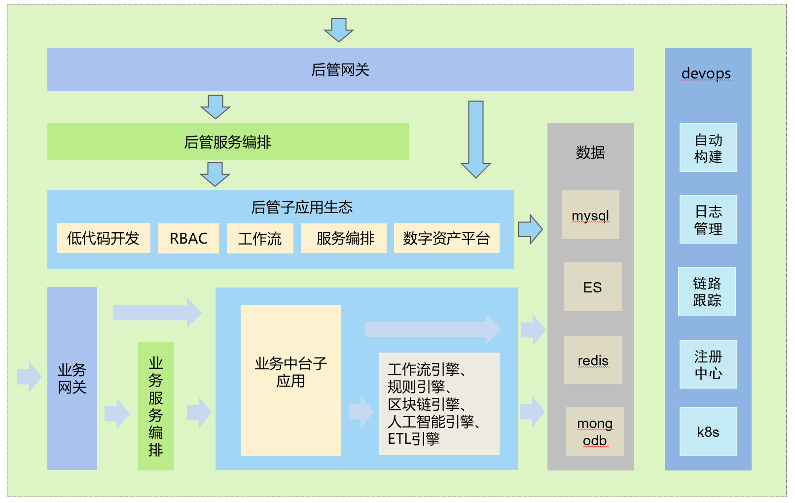
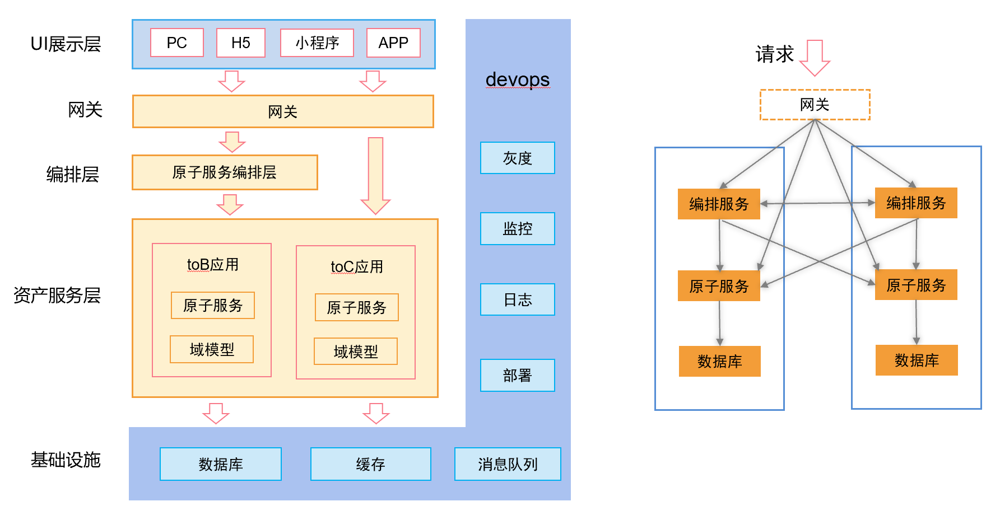
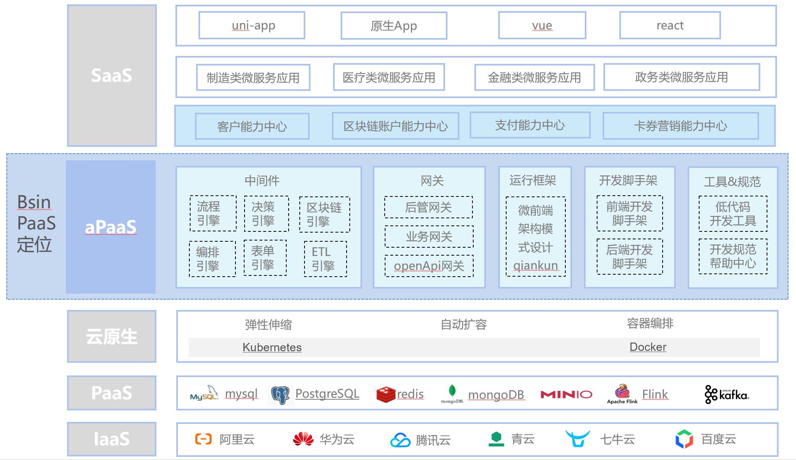
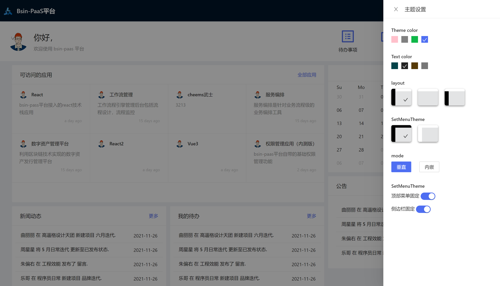
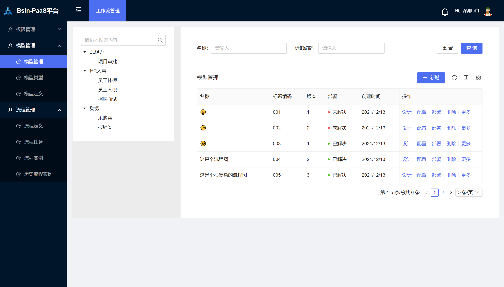

# 区块链低代码开发平台
[toc]

## 开源项目介绍
Bsin-PaaS（毕昇） 是一套企业级的低代码、零代码去中心化应用搭建平台，可帮助企业快速搭建基于云原生的有竞争力的业务中台、流程中台、业务前台。bsin-paas包括微前端设计、微服务框架、服务编排、工作流引擎、安全网关及区块链引擎。该方案由区块链(公链、联盟链)作为技术支撑,为企业提供daPaaS层的一站式解决方案，助力企业打造数字经济底层技术架构，构建一套开放式和生态化的技术体系。作为一个平台，Bsin-PaaS本身拥有自己的数字资产，以用户为中心，实现让价值掌握在拥有者手中，帮企业构建一种全新的商业生态模式。

## 产品优势：
* 开箱即用
* 生态应用独立开发、部署、运行
* 生态应用丰富：配套丰富的企业级业务应用，生态应用持续完善
* 产品持续迭代
* 币股同权

## 设计理念
* 统一企业技术路线
* 统一数字企业IT架构
* 统一企业开发流程
* 统一开发资源库

## 数字化转型三部曲
> bsin-paas 可以快速用于搭建企业技术中台


## 部署手册

* [Bsin-PaaS服务端部署文档](./Bsin-PaaS服务端部署文档.md)
* [Bsin-PaaS前端部署文档](./Bsin-PaaS前端部署文档.md)


## 项目演示

>bsin-paas平台 租户:bsin-paas 账户:admin 123456
```
http://operation.flyray.me/
```

## 平台定位
提供daPaaS层的一站式企业级技术解决方案，帮助企业快速实现商业创新，完成数字化转型。

## 理念
为经营者谋发展，为消费者权益，为投资者谋财富
共创价值 共享价值


## 平台总架构设计


## 平台架构基于DDD设计理念


## bsin-paas定位


## 工程介绍
* bsin-apps-container：微前端基座
* bsin-server-targe-gateway：网关
* bsin-server-upms：权限管理子应用后端
* bsin-ui-upms：权限管理子应用前端


> 帮助文档
* http://help.flyray.me

## bsin-paas总体规划


## UI展示
* 登录页


* 首页工作台


* 主题设置


* 权限管理


* 工作流引擎


* 工作流画布


* 服务编排


* 服务编排画布


* bsin-bot低代码平台


* 数字资产管理平台


* 数据大屏


* react 不同子应用嵌套


## 开源协议

apache license 2.0

* 允许免费用于学习.
* 商业用途需要授权.
* 对未经过授权进行二次开源或者商业化的将追究法律责任.

## 文章署名格式
>#本文作者#

博羸，外号：雷头，资深聊天工程师，前端代码搬运工，后端粘贴复制工程师，摸鱼界专家，划水界冠军，任务分工工程师，团队愿景规划师，被时代鞭策的对象

## 技术交流

## 项目团队
s11e-DAO，是一个致力于推进bsin-paas产品和生态应用开发的dao组织，社区拥有自己的NFT身份等级、数字积分和NFT交易平台。s11e-DAO的使命是帮助企业或社会组织更低成本接入区块链价值网络，用区块链技术构建一种更富有活力的数字化商业生态模式，从而实现企业实现数字化转型


加个人微信，入微信技术群


QQ交流群： 


