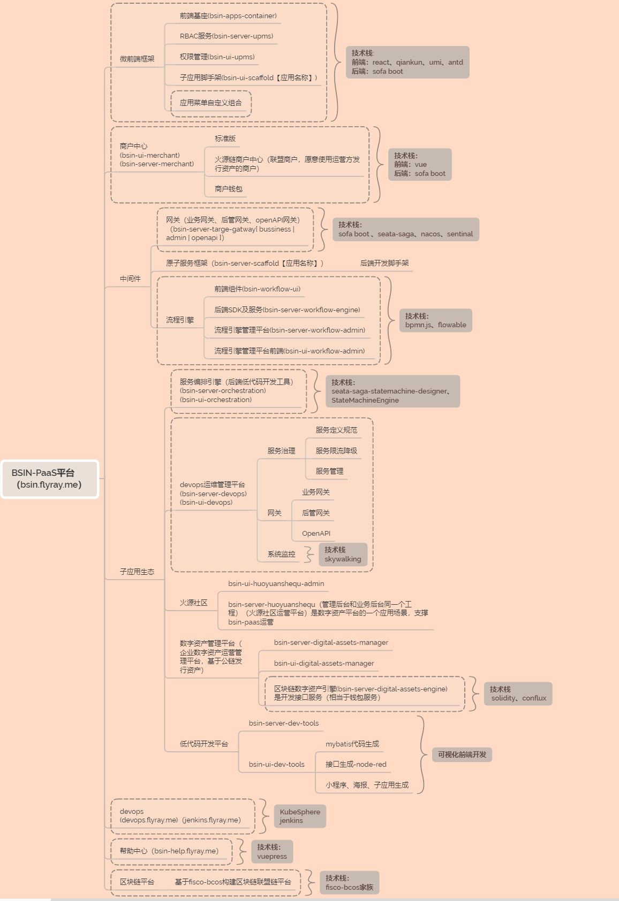
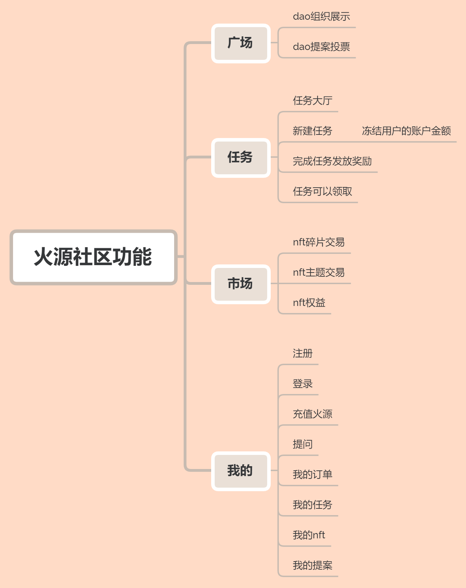
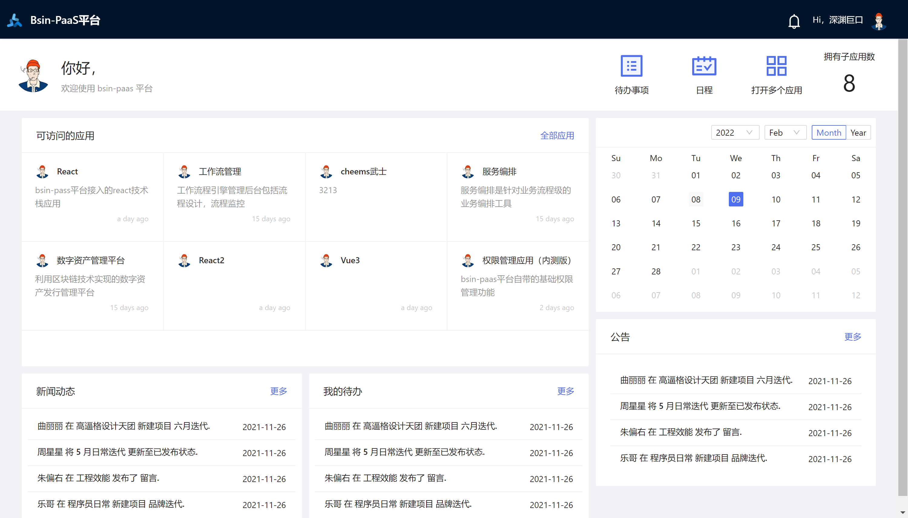
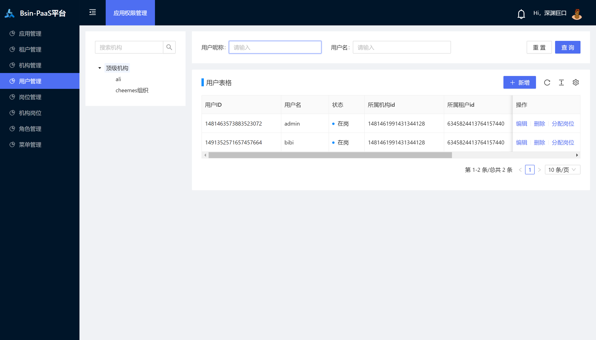
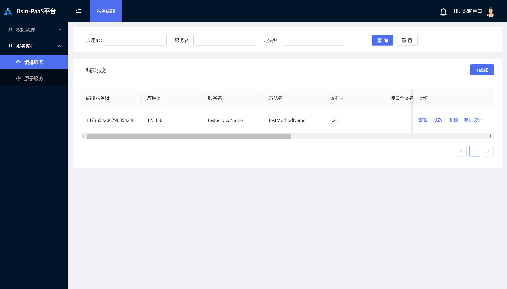
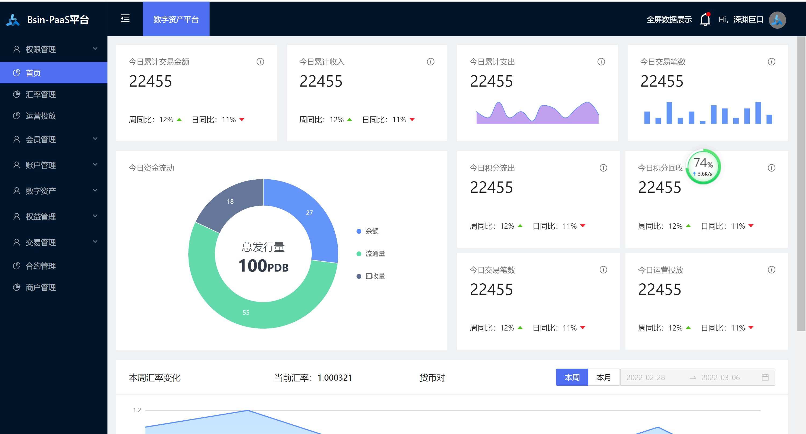
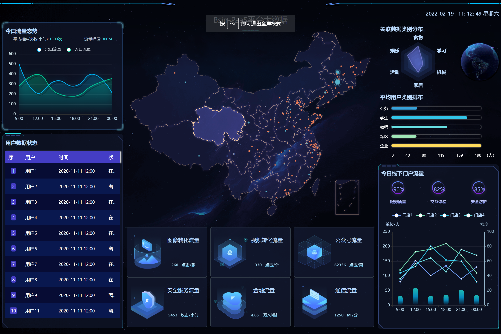
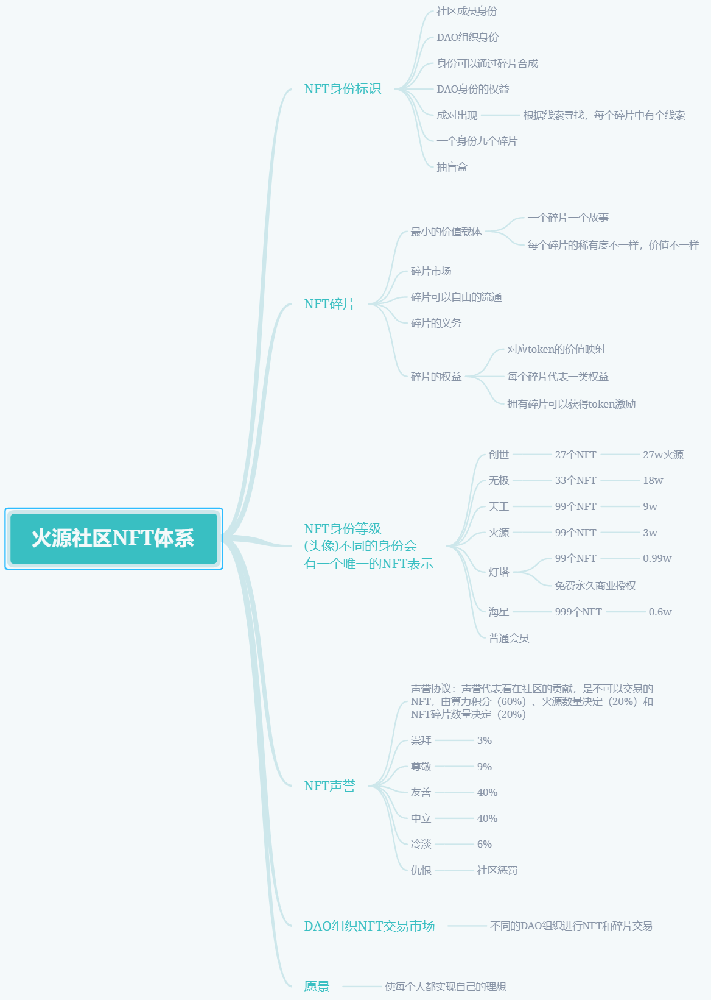

# 区块链低代码开发平台
[toc]

## 开源项目介绍
Bsin-PaaS（毕昇） 是一套企业级的低代码、零代码去中心化应用搭建平台，可帮助企业快速搭建有竞争力的业务中台、流程中台、业务前台。bsin-paas包括微前端设计、微服务框架、服务编排、工作流引擎、安全网关及区块链引擎。该方案由区块链(公链、联盟链)作为技术支撑,为企业提供daPaaS层的一站式解决方案，助力企业打造数字经济底层技术架构，构建一套开放式和生态化的技术体系。作为一个平台，Bsin-PaaS本身拥有自己的数字货币资产，以用户为中心，实现让价值掌握在拥有者手中。

## 产品优势：
* 开箱即用
* 生态应用独立开发、部署、运行
* 生态应用丰富：配套丰富的企业级业务应用，生态应用持续完善
* 产品持续迭代
* 币股同权

## 项目演示

>运营平台 租户:bsin-paas 账户:admin 123456
```
http://operation.flyray.me/
```

>商户中心
```
http://merchant.flyray.me/
```

>社区地址
```
http://www.huoyuanshequ.com
手机版
http://h5.huoyuanshequ.com
```

## 平台定位
提供daPaaS层的一站式企业级技术解决方案，帮助企业快速实现商业创新，完成数字化转型。

## 理念
为经营者谋发展，为消费者权益，为投资者谋财富
共创价值 共享价值


## 平台总架构设计


## 平台架构基于DDD设计理念


## bsin-paas定位


## 工程介绍
* bsin-apps-container：微前端基座
* bsin-server-targe-gateway：网关
* bsin-server-upms：权限管理子应用后端
* bsin-ui-upms：权限管理子应用前端

## 部署手册
* http://help.flyray.me

## bsin-paas总体规划


## 社区规划



## 数字资产平台规划


## UI展示
* 登录页


* 首页工作台


* 主题设置


* 权限管理


* 工作流引擎


* 工作流画布


* 服务编排


* 服务编排画布


* 数字资产管理平台


* 数据大屏


* react 不同子应用嵌套


## 开源协议

apache license 2.0

* 允许免费用于学习.
* 商业用途需要授权.
* 对未经过授权进行二次开源或者商业化的将追究法律责任.

## 代号
>海星计划
海星(starfish)，海星是一种分身有术的动物，它的智能分布在身体各处，一旦你打掉它身体的一部分，那个部分甚至可能自己再长成另一个海星，我们希望我们聚是一个大海星，散是无数的海星。


## 文章署名格式
>#本文作者#

博羸，外号：雷头，资深聊天工程师，前端代码搬运工，后端粘贴复制工程师，摸鱼界专家，划水界冠军

## 运营社区

火源社区，一个充满激情和想象力的数字组织，聚集了一群目标和愿望最有共鸣的人，我们试图通过开源社区驱动商业，我们默默耕耘，我们从不认为一年就可以改变世界，我们在改变世界的道路上从未停止。我们热爱技术，崇尚技术，天高任鸟飞，海空凭鱼跃。我们奔走在零代码开发趋势的道路上，顺势而为，势不可挡。同时我们在尝试借助区块链的技术建立从根本上符合人类价值观的一种团队协作工具。

## 社区NFT体系


## 社区数字积分


## 技术交流

加个人微信，入微信技术群


* QQ交流群： 


* 公众号：


* 官方网站： http://www.huoyuanshequ.com
* 官方博客： http://www.huoyuanshequ.com
* 关注官方微信公众号，获取更多资讯

## 对社区的期望
我们希望社区更多的参与进来共建，如果觉得文档不完善，可以参与完善文档，如果觉得代码有问题，可以提 PR 修复 如果希望我们能支持更多场景，也可以提 Feature Request
我们的知识是从社区而来，我们也有必要赋能社区，帮助社区更好的运作下去。

## 谈谈问题
```
* 社区建设问题：
大部分项目的社区不够强大，并缺乏一个有效激励机制将平台的用户、持币者、开发者利益捆绑在一起。
* 治理投票过程：

治理论坛发起讨论，并逐步完善，形成正式的 FIPs；
提交到 Snapshot 进行投票批准；
投票结果生效并执行。
```

## 社区治理
* DAO治理模式

## 生态应用建设计划
＊ 让每个开发者都可以独立自主的参与子应用生态建设

## 生态激励计划


## 开源地址
* https://gitee.com/bsin-paas/all-in-one.git


