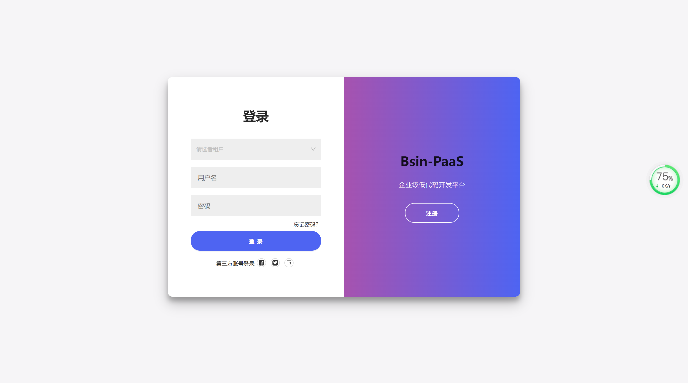
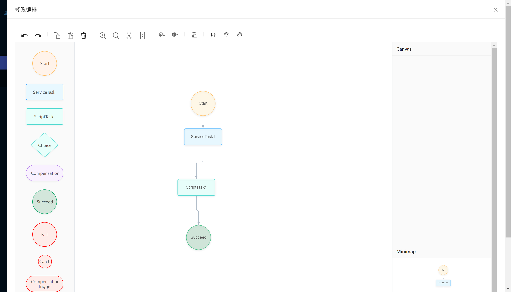

# 区块链低代码开发平台
[toc]

## 开源项目介绍
Bsin-PaaS（毕昇） 是一套企业级的低代码、零代码去中心化应用搭建平台，可帮助企业快速搭建基于云原生的有竞争力的业务中台、流程中台、业务前台。bsin-paas包括微前端设计、微服务框架、服务编排、工作流引擎、安全网关及区块链引擎。该方案由区块链(公链、联盟链)作为技术支撑,为企业提供daPaaS层的一站式解决方案，助力企业打造数字经济底层技术架构，构建一套开放式和生态化的技术体系。作为一个平台，Bsin-PaaS本身拥有自己的数字资产，以用户为中心，实现让价值掌握在拥有者手中，帮企业构建一种全新的商业生态模式。

## 设计理念
* 统一企业技术路线
* 统一数字企业IT架构
* 统一企业开发流程
* 统一开发资源库

## 部署手册

[Bsin-PaaS服务端部署文档](./Bsin-PaaS服务端部署文档.md)


###  **服务端代码部署** 

#### **环境准备**

*  特别说明

**请务必按照本文档部署运行章节进行操作，避免踩坑弯路！！**


*  环境说明

|   工具    | 版本  |     备注      |
| :-------: | :---: | :-----------: |
|    JDK    |  11   |               |
|   MySQL   |  8.0  | 建议使用MySQL |
|   IDEA    |   | 建议使用IDEA  |
| zookeeper | 3.6.2 |               |
|   seata   | 1.4.2 |               |

#### 步骤


##### 一、项目下载

> 项目下载

```
git clone https://gitee.com/bsin-paas/all-in-one.git
```


##### 二、初始化数据库

> 参数说明

```
版本： mysql8.0
默认字符集: utf8mb4
默认排序规则: utf8mb4_general_ci
```

> 脚本说明

```
bsin-server-upms\doc\init.sql   upms权限管理脚本
bsin-server-targe-gateway\src\main\resources\sql\mysql_ini.sql  网关脚本
```


##### 三、配置修改

1、数据库源信息修改（upms和网关application.properties文件都要修改）

```
spring.datasource.url=jdbc:mysql://127.0.0.1:3306/bsin-upms?characterEncoding=UTF-8&serverTimezone=Asia/Shanghai&allowMultiQueries=true&zeroDateTimeBehavior=convertToNull #修改成自己创建的数据库
spring.datasource.username=***  #用户名
spring.datasource.password=***  #密码

```

2、zookeeper配置修改(upms和网关application.properties文件都要确认IP地址是否为本机)

```
# zookeeper配置修改
com.alipay.sofa.rpc.registry.address=zookeeper://127.0.0.1:2181   
```

3、修改seata地址(bsin-server-targe-gateway) file.conf文件

```
service {
  #transaction service group mapping
  vgroupMapping.my_test_tx_group = "default"
  #only support when registry.type=file, please don't set multiple addresses
  #本地环境需要修改
  default.grouplist = "127.0.0.1:8091"			#确定IP是否为本机
  #degrade, current not support
  enableDegrade = false
  #disable seata
  disableGlobalTransaction = false
}
```


##### 四、启动顺序

1、先启动zookeeper

```java
在zookeeper的bin目录下输入命令
    
./zkServer.sh    调用zookeeper脚本
./zkServer.sh    start 启动命令
```

2、启动seata

```
在seata的bin目录下输入命令

./seata-server.bat -p 8091 -h 127.0.0.1 -m file   启动命令
```

3、进入项目找到启动类运行

```Java
//先启动网关
bsin-server-targegateway\src\main\java\me\flyray\bsin\gateway\BsinGatewayApplication.java
//继续启动upms
upms-server\src\main\java\me\flyray\bsin\server\BsinUpmsApplication.java
```

[Bsin-PaaS前端部署文档](./Bsin-PaaS前端部署文档.md)

###  **前端代码部署** 

#### **环境准备**

*  特别说明

**请务必按照本文档部署运行章节进行操作，避免踩坑弯路！！**

#### 安装node

 去官方下载node版本，进行本地安装

####  部署步骤

*  特别说明

**无论您是多年编程的高级工程师，还是刚刚入门的实习生，部署请完全参考本文档操作，避免踩坑弯**

##### 一、项目下载

> 项目下载

```
git clone https://gitee.com/bsin-paas/all-in-one.git
```

##### 二、安装依赖

1、基座依赖安装

> 进入bsin-apps-container根目录执行

```
npm install
```

2、权限管理依赖安装

> 进入bsin-ui-upms根目录执行

```
npm install
```


##### 三、配置修改

1、基座配置修改
> 进入bsin-apps-container目录，修改其config目录下的config.ts文件

```
 'process.env.baseUrl': 'http://ip:端口号'
```

2、权限管理配置修改
> 进入bsin-ui-upms目录，修改其目录下的umirc.ts文件
```
  'process.env.baseUrl': 'http://ip:端口号' 
```

##### 四、启动顺序

1、先启动基座
> 进入bsin-apps-container根目录执行

```
  npm start
```

2、启动权限管理
> 进入bsin-ui-upms根目录执行

```
  npm start
```

##### 五、访问前端
>  chrome 访问http://localhost:8080
>  默认用户名：admin
>  密码：123456


## 项目演示

>bsin-paas平台 租户:bsin-paas 账户:admin 123456
```
http://operation.flyray.me/
```

## 平台定位
提供daPaaS层的一站式企业级技术解决方案，帮助企业快速实现商业创新，完成数字化转型。

## 理念
为经营者谋发展，为消费者权益，为投资者谋财富
共创价值 共享价值


## 平台总架构设计


## 平台架构基于DDD设计理念


## bsin-paas定位


## 工程介绍
* bsin-apps-container：微前端基座
* bsin-server-targe-gateway：网关
* bsin-server-upms：权限管理子应用后端
* bsin-ui-upms：权限管理子应用前端


> 帮助文档
* http://help.flyray.me

## bsin-paas总体规划


## UI展示
* 登录页


* 首页工作台


* 主题设置


* 权限管理


* 工作流引擎


* 工作流画布


* 服务编排


* 服务编排画布


* 数字资产管理平台


* 数据大屏


* react 不同子应用嵌套


## 开源协议

apache license 2.0

* 允许免费用于学习.
* 商业用途需要授权.
* 对未经过授权进行二次开源或者商业化的将追究法律责任.

## 文章署名格式
>#本文作者#

博羸，外号：雷头，资深聊天工程师，前端代码搬运工，后端粘贴复制工程师，摸鱼界专家，划水界冠军，任务分工工程师，团队愿景规划师，时代的被鞭策对象
